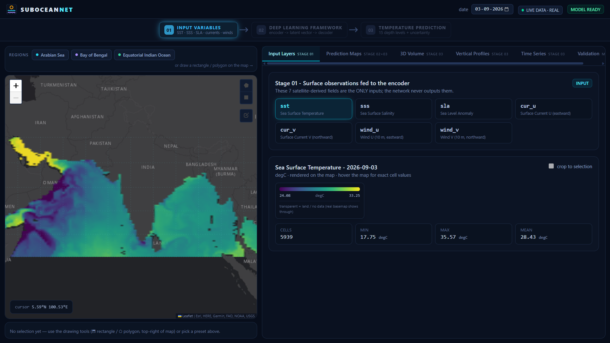
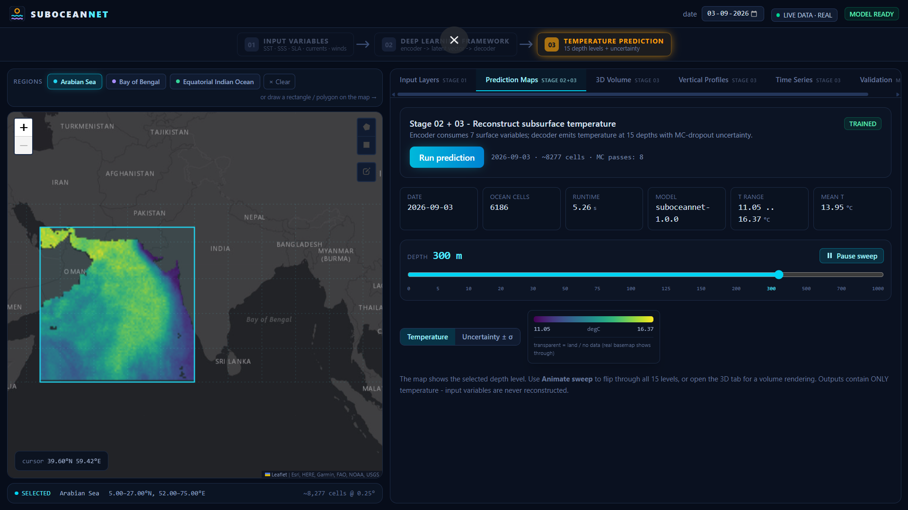
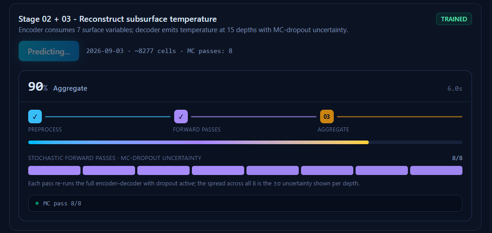
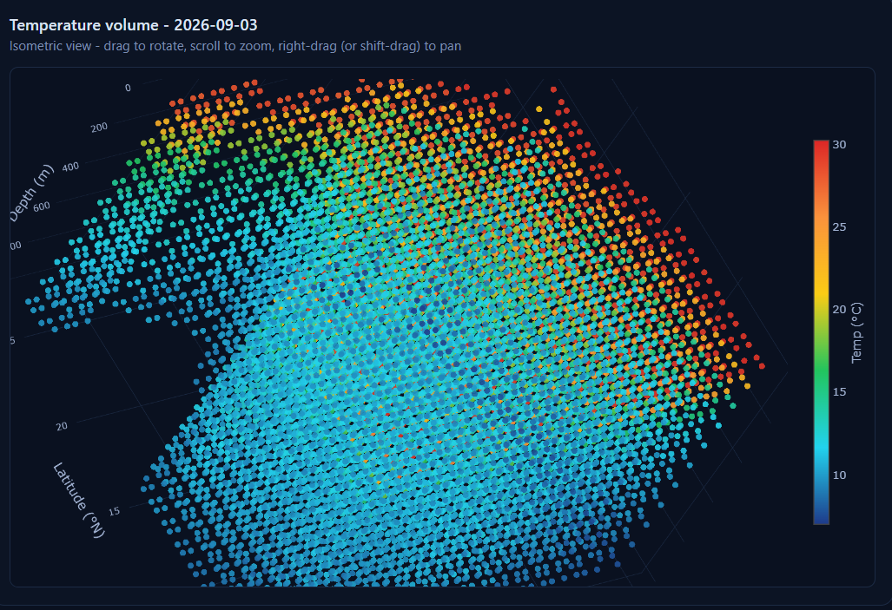
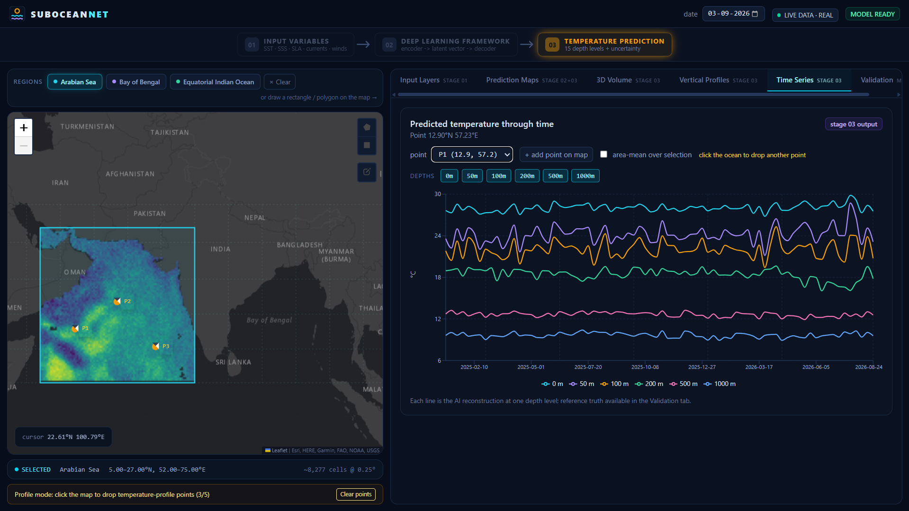

# SubOceanNet


**Satellite-based 3D subsurface ocean temperature reconstruction for the North Indian Ocean.**

SubOceanNet learns a mapping from 7 satellite-observed surface variables (sea
temperature, salinity, sea level, currents, wind) to subsurface temperature at
15 depth levels — from the surface down to 1,000 m — using a CNN encoder–decoder
with Monte-Carlo dropout uncertainty. Everything runs locally: FastAPI backend,
React + Leaflet frontend, PyTorch model.

## Screenshots

<table>
<tr>
<td width="50%"><br><sub><b>Input Layers</b> — 7 satellite surface variables</sub></td>
<td width="50%"><br><sub><b>Prediction Maps</b> — temperature at 15 depths</sub></td>
</tr>
<tr>
<td width="50%"><br><sub><b>Live progress</b> — MC-dropout passes tracked in real time</sub></td>
<td width="50%"><br><sub><b>3D Volume</b> — isometric temperature field</sub></td>
</tr>
</table>

<p align="center"><br><sub><b>Time Series</b> — predicted temperature over time, per depth</sub></p>

## Features

- **7 in, 15 out** — SST, salinity, sea-level anomaly, currents, and wind in; temperature at 15 standard depths out. The model never re-outputs its own inputs.
- **Uncertainty, not just a number** — 8 stochastic MC-dropout forward passes per prediction give a ±σ confidence band at every depth.
- **Three data modes, one config line** — synthetic demo data, static NetCDF files, or live auto-refreshed Copernicus Marine + ERA5 data.
- **Full interactive UI** — draw a region, run a prediction, sweep through depths, drop vertical-profile points, chart time series, and check validation metrics — all on one map.

## Tech stack

Python · PyTorch · FastAPI &nbsp;|&nbsp; React · TypeScript · Vite · Leaflet &nbsp;|&nbsp; Copernicus Marine · ERA5

## Getting started

Requires Python 3.10–3.12 and Node.js.

```powershell
# one-time setup: venv, deps, demo data, demo model
powershell -ExecutionPolicy Bypass -File scripts\setup.ps1

# run it
bin\start.cmd
```

Open **http://localhost:5173**. Backend API docs at **http://127.0.0.1:8000/docs**.

On Linux/macOS: `scripts/setup.sh`, then `bin/start.sh`.

## Project structure

```
suboceannet/
├── backend/main.py       # FastAPI app — all endpoints, job queue
├── src/
│   ├── models/            # CNN/ViT encoder → MLP decoder
│   ├── data/               # loaders, preprocessing, live-data fetch
│   ├── train.py
│   └── inference.py
├── frontend/src/          # React views: Inputs, Prediction, Volume3D,
│                          # Profiles, TimeSeries, Validation
├── configs/config.yaml    # region, model, training, data source — single source of truth
└── scripts/               # setup + live-data fetch scripts
```

## Model

Input `(B, 7, H, W)` → CNN encoder (7→32→64→128 channels) → 256-dim latent →
MLP decoder → `(B, 15)` temperature. Run 8× with dropout active for MC-dropout
uncertainty. Domain: 5°N–30°N, 45°E–105°E at 0.25° resolution.

---

Non-goals: operational forecasting, non-NIO regions, sub-0.25° resolution, GPU requirement, authentication.
